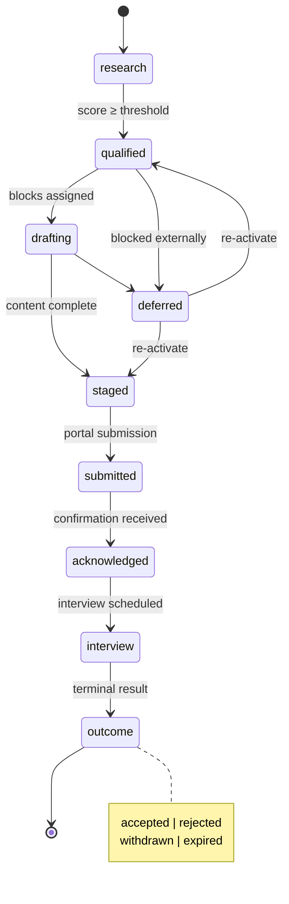

# application-pipeline

[](https://github.com/4444j99/application-pipeline/actions/workflows/quality.yml)


Career application infrastructure treating job, grant, and residency search as a **conversion pipeline**. Implements a "Cathedral → Storefront" philosophy: preserving deep, immersive systemic work while providing high-signal, scannable entry points for reviewers.

## Motivation

Application processes waste enormous energy on redundant writing. This system treats narrative content as **reusable atoms** (blocks), composes them into **target-specific molecules** (submissions), tracks outcomes as **conversion data**, and uses that data to improve future applications.

## Quick Start

```bash
pip install -e ".[dev]"      # Install with dev dependencies
make verify-quick            # Deterministic local verification (python -m pytest)

python scripts/run.py standup      # Daily dashboard
python scripts/run.py campaign     # Deadline-aware campaign view
python scripts/run.py score <id>   # Score a single entry
python scripts/run.py submit <id>  # Generate portal-ready checklist
python scripts/run.py --help       # All 40+ commands
```

## Pipeline State Machine



## Architecture

```
pipeline/          One YAML per application (state machine entries)
  active/          Actionable entries (research → staged)
  submitted/       Post-submission tracking
  closed/          Terminal outcomes
  research_pool/   Auto-sourced candidates (~940 entries)
blocks/            Modular narrative building blocks (tiered: 60s / 2min / 5min / cathedral)
variants/          A/B tracked material versions (cover letters, project descriptions)
materials/         Resumes (base + tailored batches), CVs, work samples
targets/           Target research, profiles (44 target-specific JSONs)
signals/           Conversion analytics (logs, patterns, outreach)
strategy/          Scoring rubric, identity positions, market intelligence
scripts/           52 Python CLI tools (all import from pipeline_lib.py)
tests/             1263 pytest tests
docs/              Architecture rationale and workflow guides
```

## Scoring Model

Every entry is scored across 8 weighted dimensions:

| Dimension | Weight | What it measures |
|-----------|--------|------------------|
| Mission Alignment | 20% | How well the opportunity matches identity position |
| Evidence Match | 15% | Strength of portfolio evidence for this target |
| Track Record Fit | 15% | Relevant experience alignment |
| Financial Alignment | 10% | Compensation / grant amount viability |
| Effort to Value | 15% | Time investment vs. potential return |
| Strategic Value | 10% | Network effects, learning, positioning |
| Deadline Feasibility | 10% | Can we produce quality work in time? |
| Portal Friction | 5% | Submission complexity and platform friction |

## Identity Positions

Every application aligns to one of five canonical positions:

1. **Independent Engineer** — AI lab roles. Focus: infrastructure, testing, AI-conductor methodology
2. **Systems Artist** — Art grants/residencies. Focus: governance as artwork, systemic scale
3. **Educator** — Academic roles. Focus: teaching complex systems at scale
4. **Creative Technologist** — Tech grants/consulting. Focus: AI orchestration, creative instruments
5. **Community Practitioner** — Identity-specific funding. Focus: precarity-informed systemic practice

## Session Sequences

| Workflow | Commands |
|----------|----------|
| **Morning** | `standup` → `followup` → `outcomes` → `campaign` |
| **Submit** | `campaign` → `check <id>` → `submit <id>` → `record <id>` |
| **Research** | `hygiene` → `scoreall` → `qualify` → `enrichall` |
| **Analyze** | `funnel` → `conversion` → `velocity` → `dashboard` |
| **Strategy** | `startup` → `funding` → `differentiate` → `tracker` |

## Development

```bash
make verify                                 # Full verification gates (matrix + lint + validate + full tests)
make verify-quick                           # Faster local verification loop
make preflight                              # Staged preflight gate
python scripts/verification_matrix.py --strict  # Module-to-verification route coverage
python -m ruff check scripts/ tests/         # Lint only
python -m pytest tests/ -v                   # Full test suite only
python scripts/validate.py                   # YAML schema validation
```

CI runs on every push/PR via `.github/workflows/quality.yml` with a Python 3.11/3.12 matrix; scheduled full regression also uploads verification artifacts.

## License

[MIT](LICENSE)

<!-- SYSTEM-NAV-START -->

---

<sub>[Portfolio](https://4444j99.github.io/portfolio/) · [System Directory](https://4444j99.github.io/portfolio/directory/) · [ORGAN 4444J99](https://4444J99.github.io/) · Part of the <a href="https://4444j99.github.io/portfolio/directory/">ORGANVM eight-organ system</a></sub>

<!-- SYSTEM-NAV-END -->
