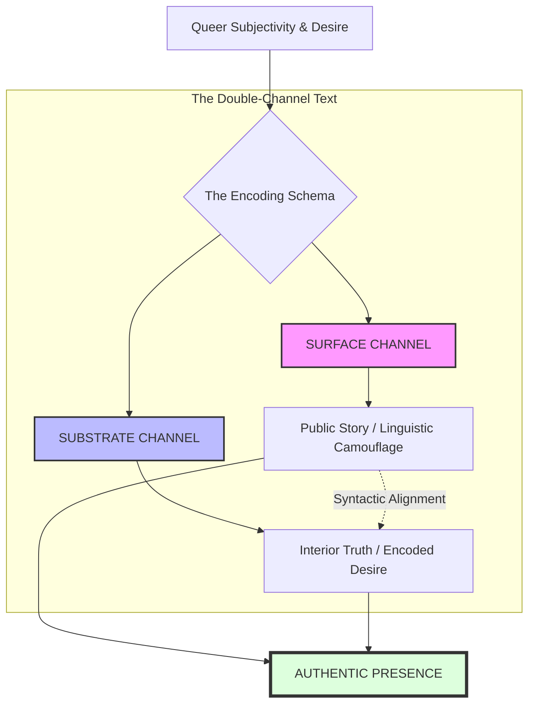
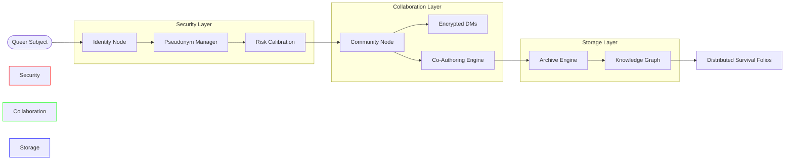
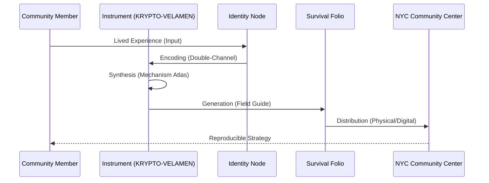

# KRYPTO-VELAMEN: Visual Identity & Diagrams

These five visual designs represent the technical architecture, theoretical framework, and community-driven mission of the KRYPTO-VELAMEN instrument.

---

## 1. The "Double-Channel" Logic (Mermaid)
This diagram illustrates the core compositional engine: how queer subjectivity is split into simultaneous surface and substrate stories.



---

## 2. The Instrument Interface (ASCII Art)
A mock-up of the "Compositional Dials" used to calibrate the level of concealment vs. visibility in a given text.

```text
========================================================================
| KRYPTO-VELAMEN // INSTRUMENT v1.0 // CALIBRATION INTERFACE           |
========================================================================
|                                                                      |
|  [ CONCEALMENT DIALS ]                                               |
|                                                                      |
|  1. Rimbaud Drift    [||||||||||||||||||..........]  64% (Camouflage)|
|  2. Wilde Mask       [||||||||||||||||||||||||....]  82% (Surface)   |
|  3. Burroughs Control [||||||||||..................]  38% (Structure) |
|                                                                      |
|  ------------------------------------------------------------------  |
|                                                                      |
|  [ VISIBILITY DIALS ]                                                |
|                                                                      |
|  4. Lorde Voice      [||||||||||||||||||||||||||..]  94% (Naming)    |
|  5. Arenas Scream    [||||||||||||||||............]  52% (Excess)    |
|  6. Acker Piracy     [||||||||||||||||||||........]  70% (Inscribe)  |
|                                                                      |
|  ------------------------------------------------------------------  |
|  STATUS: SECURE // IDENTITY: PSEUDO-ALPHA-9 // ARCHIVE: ACTIVE       |
========================================================================
```

---

## 3. Distributed Platform Architecture (Mermaid)
This diagram maps the microservices architecture, emphasizing community safety and risk-calibrated identity.



---

## 4. The Compositional Engine (ASCII Diagram)
A visualization of the "machine" logic: where research flows in and survival tools flow out.

```text
      [ 20 AUTHOR STUDIES ]       [ 26 WORLD-BUILDING MODULES ]
               |                                |
               v                                v
    ________________________________________________________
   |                                                        |
   |             KRYPTO-VELAMEN SYNTHESIS CORE              |
   |________________________________________________________|
               |                |               |
               v                v               v
      [ MECHANISM ATLAS ]  [ AUTHOR CROSSWALK ] [ VISIBILITY SCHEMA ]
               |                |               |
               \________________|_______________/
                                |
                                v
                  [ THE DISTRIBUTED INSTRUMENT ]
                                |
                __________________________________
               |                                  |
               v                                  v
      [ COMMUNITY WORKSHOPS ]            [ SURVIVAL FOLIOS ]
```

---

## 5. The Community Knowledge Loop (Mermaid)
Showing how lived experience is transformed into reproducible survival strategies for the NYC community.


